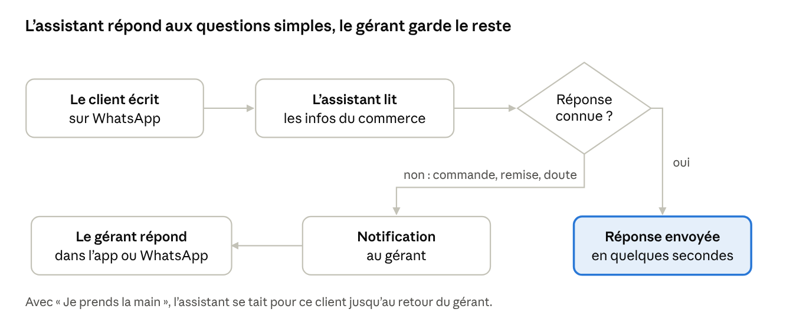

# CréeTonAgent — Fonctionnement & Business Model

4 octobre 2026 · Export du document de travail ([version en ligne, modifiable et commentable](https://claude.ai/code/artifact/31fffaaf-8ba0-4db6-be95-62693ad3e428)).

> Décisions prises depuis : la mascotte s'appelle **Tiko**, le mot utilisé dans l'app est **« assistant »**, et le prototype démarre sur iPhone (diffusion par lien web en attendant le compte Apple).

## En bref

CréeTonAgent donne à un petit commerce d'Abidjan un assistant qui répond à ses clients sur WhatsApp, 24h/24, configuré en 10 minutes depuis le téléphone, sans compétence technique.

- **Pour qui :** restaurants et maquis, boutiques et vendeurs en ligne (TikTok, Instagram, Facebook), avec ou sans boutique physique.
- **Ce qu'on vend :** du temps gagné et des ventes non perdues. L'assistant répond aux questions répétitives (prix, livraison, paiement, horaires) et passe la main au commerçant pour commander, négocier ou régler un cas difficile.
- **Comment on gagne de l'argent :** un abonnement mensuel en FCFA, payé par Wave ou Orange Money, avec un essai gratuit. Le prix de départ proposé est 7 500 F par mois.
- **Pourquoi ça peut marcher :** les clients écrivent déjà sur WhatsApp, et les outils existants sont des tableaux de bord en anglais faits pour des techniciens.

Ce document fixe le fonctionnement et le modèle économique avant de concevoir et coder la vraie app. Les chiffres marqués « hypothèse » sont à valider sur le terrain.

## Le problème et les cibles

Le commerçant perd des ventes parce qu'il ne peut pas répondre à tout le monde, tout de suite, sur WhatsApp. Le client qui attend 2 heures pour un prix achète ailleurs.

| Profil | Exemple | Ce qu'on lui demande sans arrêt | Sa douleur | Ce qui le ferait payer |
| --- | --- | --- | --- | --- |
| Restaurant / maquis | Maquis à Yopougon, 2 à 5 employés | « C'est combien le garba ? », « Vous livrez à Selmer ? », « Vous êtes ouverts ? » | Pic de messages aux heures de service, quand personne n'a le temps de répondre | Plus de commandes livrées aux heures de pointe |
| Vendeuse en ligne | Vendeuse de robes et perruques sur TikTok, sans boutique | « Prix ? » sous chaque vidéo, « Taille XL dispo ? », « Livraison Abobo combien ? » | Des dizaines de « prix svp » par jour après une vidéo qui marche, souvent la nuit | Ne plus rater de clients quand une vidéo fait le buzz |
| Boutique physique | Boutique de prêt-à-porter à Cocody | Prix, disponibilité, adresse, horaires | Le gérant est en caisse ou en rayon, le téléphone sonne | Réponses immédiates sans embaucher |

Points communs : tout passe déjà par WhatsApp, le paiement se fait par Wave ou Orange Money ou en espèces à la livraison, et le gérant gère tout depuis son téléphone.

À valider : la part de ces commerçants qui utilisent un iPhone, puisque l'app de départ est sur iOS.

## Comment l'app fonctionne

Il y a deux utilisateurs : le commerçant, qui configure et surveille l'assistant dans l'app, et son client, qui ne voit rien d'autre que WhatsApp.

### Le parcours du commerçant

1. **Inscription** avec son numéro de téléphone et un code reçu par SMS. Pas de mot de passe, pas d'e-mail.
2. **Choix de l'activité** : restaurant / maquis ou boutique / vente en ligne. Chaque activité a ses propres questions.
3. **Questions guidées**, une par écran : nom, où il vend, comptes TikTok ou Instagram, adresse si boutique physique, horaires, produits et prix, zones et frais de livraison, moyens de paiement, ton de l'assistant.
4. **Produits et prix** : une photo du menu ou de la liste de prix, l'IA remplit la liste, le commerçant corrige.
5. **Test** : il écrit comme un client. Si une réponse est fausse, il donne la bonne et l'assistant la retient.
6. **Connexion WhatsApp** : il relie le numéro WhatsApp Business de son commerce. L'assistant est actif.
7. **Au quotidien** : il reçoit une notification quand un client veut commander ou quand l'assistant ne sait pas répondre, ouvre la conversation et répond lui-même.

### Le parcours du client final

Le client écrit au numéro WhatsApp habituel du commerce, comme avant. L'assistant répond en quelques secondes, en français, avec le ton choisi. Quand il veut commander, l'assistant note la demande et le gérant prend le relais dans la même conversation.

Chaque message passe par la même question : l'assistant connaît-il la réponse à partir des infos enregistrées ? Si non, il ne devine pas, il prévient le gérant.

### Ce que l'assistant fait, et ne fait pas

| L'assistant fait | L'assistant ne fait pas (il passe la main) |
| --- | --- |
| Donne les prix et la disponibilité connue | Négocie un prix, accorde une remise ou un prix de gros |
| Explique la livraison : zones, frais, délais | Confirme une commande ou un paiement |
| Indique les moyens de paiement et l'adresse | Promet un délai ou un stock qu'il ne connaît pas |
| Renvoie vers les vidéos TikTok ou la page Instagram | Répond à une réclamation ou un client mécontent |
| Note une commande et prévient le gérant | Invente une réponse quand il ne sait pas |

Règle d'or : en cas de doute, l'assistant dit qu'il transmet au responsable, et le commerçant est notifié.

### La reprise en main

Dans chaque conversation, un bouton « Je prends la main » met l'assistant en pause pour ce client. Le commerçant répond depuis l'app ou directement depuis WhatsApp. L'assistant reprend automatiquement après une période sans message du gérant, par exemple 2 heures (hypothèse à régler).

### Corriger l'assistant

Une correction doit permettre au commerçant de dire ce que l'assistant doit faire, pas seulement quoi écrire. Exemple repéré au test : un client écrit « je veux payer sac oh », l'assistant répond qu'il transmet au gérant, alors qu'il aurait dû montrer le catalogue. Le prototype ne permettait que du texte libre.

Quand le commerçant touche « Mauvaise réponse », il choisit d'abord ce que l'assistant aurait dû faire :

| Action proposée | Ce que l'assistant enverra |
| --- | --- |
| Montrer le catalogue | La liste des produits et prix, toujours à jour |
| Donner le prix d'un produit | Le produit choisi dans la liste et son prix |
| Expliquer la livraison | Zones et frais enregistrés |
| Expliquer le paiement | Moyens de paiement, plus tard un lien Wave ou Orange Money |
| Prendre la commande et me prévenir | Confirmation au client, notification au gérant |
| Me passer la main | Message d'attente, notification immédiate |
| Écrire ma propre réponse | Le texte tapé par le commerçant |

L'action s'appuie sur les infos enregistrées : si un prix change, la réponse corrigée reste juste. L'assistant retient aussi la façon de parler du client, par exemple que « je veux payer sac oh » veut dire « je veux acheter un sac ».

Cette correction par action est reprise dans le prototype et dans la vraie app.

## Ce qui entre dans la première version

La première version fait une seule chose très bien : répondre juste sur WhatsApp et prévenir le gérant au bon moment. Le reste attend que des commerçants paient.

| Fonctionnalité | Première version | Plus tard |
| --- | --- | --- |
| Inscription par numéro de téléphone | Oui | |
| Restaurant / maquis et boutique / vente en ligne | Oui | Salon de beauté, pharmacie, immobilier |
| Produits et prix par photo | Oui | Synchronisation avec le catalogue WhatsApp |
| Chat de test et corrections | Oui | |
| Réponses automatiques sur WhatsApp | Oui | Instagram et Facebook Messenger |
| Notifications et « Je prends la main » | Oui | |
| Statistiques simples (messages, clients, temps gagné) | Oui | Ventes générées, heures de pointe |
| Comprendre les notes vocales des clients | | Oui, en priorité |
| Envoyer les photos des produits | | Oui |
| Lien de paiement Wave / Orange Money dans le chat | | Oui |
| Messages de relance et promotions | | Oui |
| Plusieurs employés sur un même compte | | Oui |
| App Android | | Oui, dès que le pilote iPhone est validé |

Règle ajoutée après le test du prototype : toutes les infos données à l'inscription restent modifiables à tout moment dans « Mon assistant » (nom, adresse, horaires, produits, livraison, paiement, ton), ainsi que les réponses apprises. L'assistant utilise les nouvelles infos dès l'enregistrement.

## Le modèle économique

On vend un abonnement mensuel simple, compté en réponses envoyées par l'assistant, payé par Wave ou Orange Money. Une réponse = un message envoyé par l'assistant à un client.

| Offre | Prix | Inclus | Pour qui |
| --- | --- | --- | --- |
| Essai | 0 F pendant 14 jours | Assistant complet sur WhatsApp, jusqu'à 100 réponses | Tout nouveau commerçant |
| Essentiel | 7 500 F / mois | 1 numéro WhatsApp, 600 réponses par mois, notifications, reprise en main | Vendeuse en ligne, petit maquis |
| Pro | 19 900 F / mois | 2 500 réponses par mois, statistiques détaillées, 2 employés, notes vocales dès qu'elles existent | Restaurant ou boutique avec beaucoup de messages |
| Recharge | 2 000 F | 250 réponses de plus, valables jusqu'à la fin du mois | Pic de messages, vidéo qui fait le buzz |

Tous les prix sont des hypothèses à tester avec les premiers commerçants.

**Règles commerciales proposées**

- Pas de carte bancaire. Paiement mensuel par Wave ou Orange Money, rappel 3 jours avant l'échéance sur WhatsApp.
- 3 mois payés d'avance = 10 % de remise. Cela réduit les oublis de paiement.
- Quota atteint : l'assistant ne coupe pas net. Il continue 24 heures, le commerçant est prévenu et propose une recharge en un clic.
- Abonnement non payé : l'assistant se met en pause, les données sont gardées 60 jours.
- Mise en place accompagnée par un agent sur place : 5 000 F, offerte pendant le pilote.

**Paiement et iPhone.** Apple impose son propre système de paiement pour un abonnement acheté dans une app iOS, avec une commission. On propose donc de vendre l'abonnement hors de l'app, par un lien de paiement Wave ou Orange Money envoyé sur WhatsApp, et de ne montrer aucun bouton d'achat dans l'app iPhone. Cette approche est courante, mais elle est à vérifier avec les règles de l'App Store avant la publication.

## Coûts par client et marge

L'offre Essentiel garde une marge d'environ 70 à 90 %. L'offre Pro descend vers 40 à 65 %, car WhatsApp facture les réponses au-delà de 1 000 par mois.

| Poste (par mois) | Essentiel : 600 réponses | Pro : 2 500 réponses | Base du calcul |
| --- | --- | --- | --- |
| IA | 600 à 1 800 F | 2 500 à 7 500 F | 1 à 3 F par réponse selon le modèle |
| WhatsApp (Meta) | 0 F | 3 600 à 4 100 F | 1 000 réponses gratuites par numéro, puis environ 2,5 F par réponse |
| Serveur et stockage | 200 F | 300 F | Un serveur partagé entre plusieurs dizaines de commerçants |
| Frais de paiement | 75 F | 200 F | Environ 1 % avec Wave |
| SMS de connexion | 50 F | 50 F | Quelques codes par mois |
| **Total coûts** | **925 à 2 125 F** | **6 650 à 12 150 F** | |
| **Prix** | **7 500 F** | **19 900 F** | |
| **Marge brute** | **72 à 88 %** | **39 à 67 %** | |

Hypothèses : 1 dollar = 600 F ; une réponse lit les infos du commerce et quelques messages précédents, avec mise en cache ; la Côte d'Ivoire est facturée par Meta au tarif « reste de l'Afrique ».

Ce que ça implique :

- **Le modèle d'IA compte.** Un modèle rapide et peu cher pour les questions simples, un modèle plus fort seulement pour la lecture de photo ou les cas difficiles.
- **Le quota de l'offre Pro doit rester sous contrôle.** Au-delà de 2 500 réponses, la recharge doit couvrir le coût WhatsApp.
- **Le mode QR code** (connexion comme WhatsApp Web) n'a pas de frais Meta, mais le numéro du commerçant risque d'être bloqué. Il est réservé au pilote.

Sources : tarifs de l'API Claude (Haiku 4.5 : 1 $ et 5 $ par million de jetons en entrée et en sortie ; Sonnet 5.5 : 2 $ et 10 $), grille officielle d'Anthropic de septembre 2026. Tarifs WhatsApp et Wave : pages non consultables depuis l'environnement de travail, chiffres tirés de résumés de recherche ([changement d'octobre 2026](https://blueticks.co/blog/whatsapp-business-api-pricing-2026), [tarifs par pays](https://www.flowcall.co/blog/whatsapp-business-api-pricing), [frais Wave](https://blog.iambeezy.app/fr/grille-tarifaire-wave-ci-2026/)). À vérifier sur la page tarifs de Meta avant de fixer les prix.

## Trouver les premiers clients

Les premiers clients viendront du terrain et de TikTok, pas de la publicité payante : un commerçant achète ce qu'il a vu marcher chez un autre commerçant.

1. **Pilote gratuit avec 10 commerçants** (5 restaurants ou maquis, 5 vendeurs en ligne), choisis dans notre réseau. En échange : un retour chaque semaine et un témoignage vidéo.
2. **Démonstration en 2 minutes** : on configure l'assistant devant le commerçant avec la photo de son menu, puis il s'écrit lui-même depuis son téléphone. C'est l'argument le plus fort.
3. **TikTok et Instagram** : vidéos courtes « avant / après », par exemple une vendeuse qui reçoit 50 « prix svp » pendant qu'elle dort, et l'assistant qui répond à tous.
4. **Parrainage** : 1 mois offert au parrain et au filleul.
5. **Agents terrain** payés à la commission, par exemple le premier mois d'abonnement, dans les zones commerçantes (Adjamé, Treichville, Cocody, Yopougon).
6. **Partenaires** : livreurs, associations de commerçants, formateurs en vente en ligne, qui recommandent l'outil à leurs membres.

Objectif proposé pour les 3 mois qui suivent le pilote : 50 commerçants payants, avec au moins 70 % qui renouvellent après le premier mois.

## Concurrence et différenciation

Le vrai concurrent, c'est le commerçant qui répond lui-même quand il a le temps. Les outils existants ne visent pas nos cibles.

| Alternative | Ce que c'est | Pourquoi elle ne suffit pas à nos cibles |
| --- | --- | --- |
| Répondre soi-même ou un employé | La solution actuelle | Lent aux heures de pointe et la nuit ; un employé coûte bien plus qu'un abonnement |
| Réponses rapides de WhatsApp Business | Messages types et message d'absence, gratuits | Ne comprend pas la question, ne donne pas le bon prix |
| Outils internationaux (type Chatbase) | Chatbots IA à partir d'un site web | En anglais, paiement par carte en dollars, faits pour un site plutôt que pour WhatsApp |
| Outils open source (Dify, Typebot) | Plateformes à installer soi-même | Il faut un développeur et un serveur |
| Agences locales | Chatbot fait sur mesure | Cher, long, et le commerçant ne peut rien modifier seul |

Ce qui nous distingue :

- **Pensé pour le téléphone** : tout se fait dans l'app, en 10 minutes, sans ordinateur.
- **Pensé pour Abidjan** : français et façon de parler d'ici, communes d'Abidjan, Wave et Orange Money, prix en FCFA.
- **Pensé pour les vendeurs en ligne** : TikTok, Instagram et Facebook pris en compte dès l'inscription.
- **Le commerçant garde la main** : correction en un geste, reprise de la conversation à tout moment.

À surveiller : Meta développe ses propres assistants IA pour entreprises dans WhatsApp. S'ils arrivent en Côte d'Ivoire, notre avantage devra venir de la simplicité, du local et de l'accompagnement.

## Risques et parades

Le risque principal est la confiance : une seule réponse fausse sur un prix et le commerçant coupe l'assistant.

| Risque | Conséquence | Parade |
| --- | --- | --- |
| L'assistant donne un prix ou une info faux | Le commerçant perd confiance et résilie | Réponses limitées aux infos enregistrées ; dans le doute, il passe la main ; correction en un geste |
| Numéro WhatsApp bloqué en mode QR code | Le commerçant perd son numéro | QR code seulement pour le pilote, avec un second numéro ; API officielle de Meta avant le lancement |
| Peu de commerçants sur iPhone | Pilote difficile à remplir | Vérifier dès le recrutement ; Android dès que le pilote est validé |
| Abonnements non renouvelés | Revenus instables | Rappels WhatsApp, paiement en un clic, remise sur 3 mois, statistiques qui montrent le temps gagné |
| Hausse des coûts WhatsApp ou IA | Marge qui fond | Quotas par offre, recharges, modèle d'IA léger par défaut |
| Règles de paiement de l'App Store | App refusée ou commission | Abonnement vendu hors de l'app, sans bouton d'achat sur iPhone |
| Données personnelles des clients | Sanction, perte de confiance | Se mettre en règle avec la loi ivoirienne sur les données personnelles (ARTCI) avant le lancement, à vérifier avec un juriste |
| Meta lance son propre assistant | Concurrence gratuite | Miser sur la simplicité, le local, les vendeurs TikTok et l'accompagnement |

## Décisions à prendre et prochaines étapes

Quatre décisions bloquent la conception de la vraie app ; le reste peut évoluer pendant le pilote.

**À décider ensemble**

- [ ] Prix : garder 7 500 F et 19 900 F, ou tester d'autres niveaux avec les premiers commerçants ?
- [ ] Unité de compte : nombre de réponses, ou nombre de clients servis par mois (plus simple à comprendre) ?
- [ ] WhatsApp : mode QR code pour le pilote, ou API officielle de Meta dès le départ ?
- [ ] iPhone seulement pour le pilote, ou Android tout de suite si les commerçants recrutés sont sur Android ?

**Prochaines étapes**

- [ ] Interroger 10 commerçants (5 restaurants, 5 vendeurs en ligne) : nombre de messages par jour, téléphone utilisé, prix qu'ils accepteraient de payer.
- [ ] Leur montrer le prototype et noter ce qui bloque, comme la correction par action repérée au test.
- [ ] Vérifier les tarifs WhatsApp sur la page officielle de Meta et les règles de paiement de l'App Store.
- [ ] Mettre à jour ce document avec les réponses, puis passer à la conception des écrans et au code.
