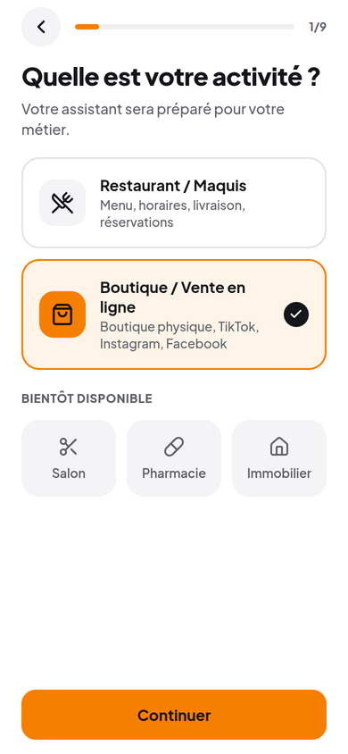
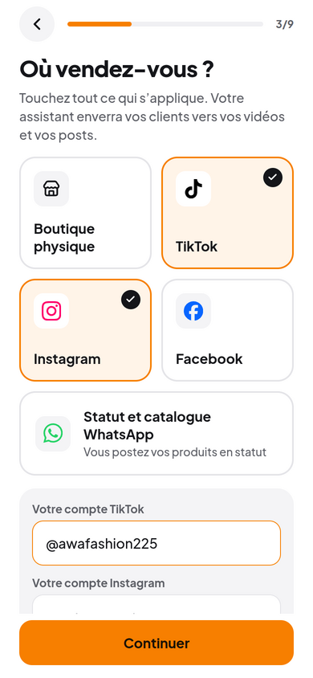
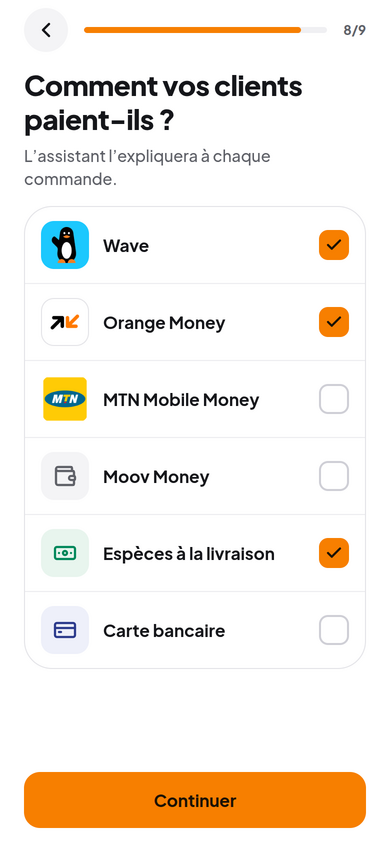
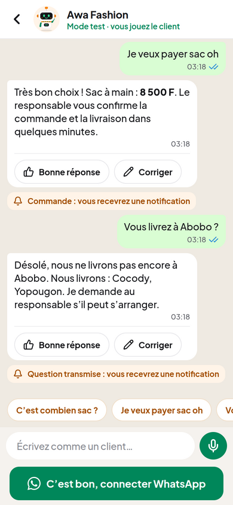
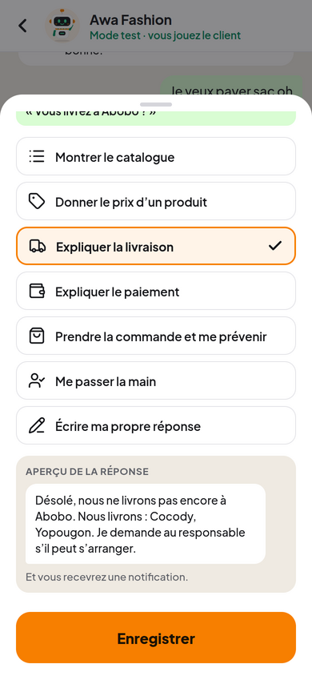
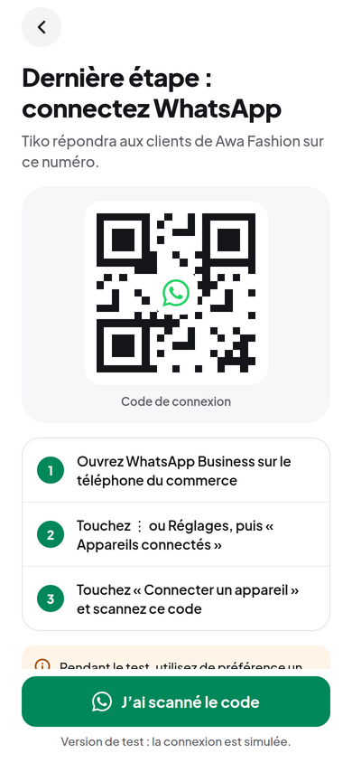
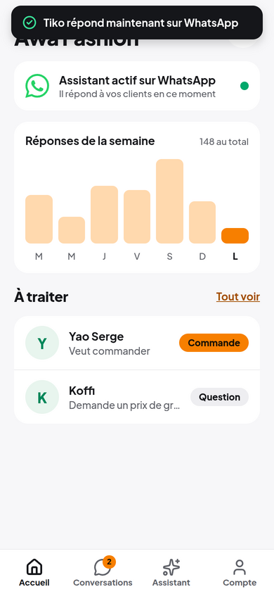
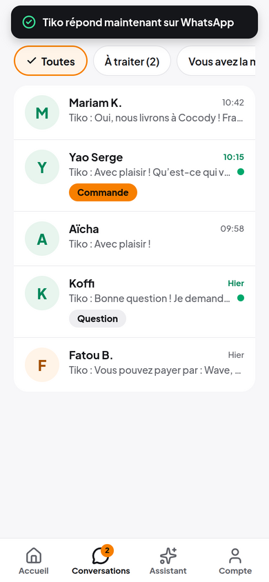
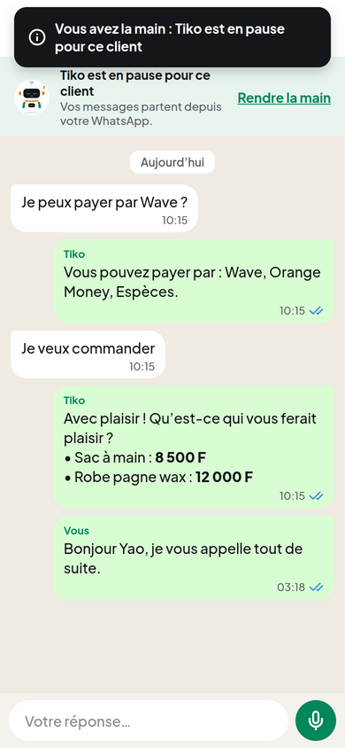
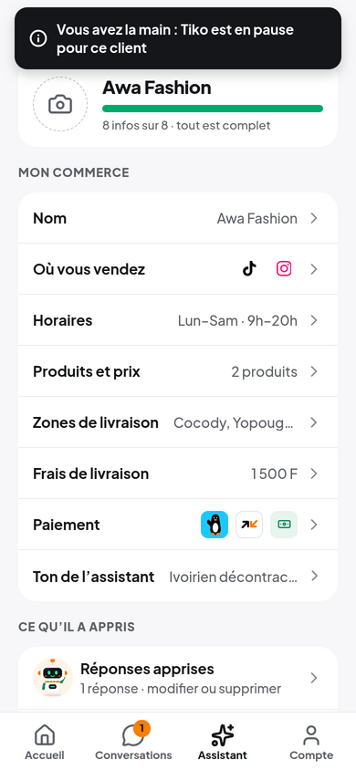

# CréeTonAgent — prototype v2

Prototype cliquable de l’app, avec le design validé
([maquettes](../../design/README.md)) : un commerçant d’Abidjan crée **Tiko**,
son assistant WhatsApp, en quelques minutes.

> **Prototype :** aucune donnée n’est envoyée. Le code SMS, la lecture de photo,
> l’IA et la connexion WhatsApp sont **simulés**, pour tester l’expérience avec
> de vrais commerçants avant de construire le backend.

## Aperçu

Captures de la version web (dossier [`screenshots/`](screenshots)) :

| | | |
| --- | --- | --- |
|  |  |  |
|  |  |  |
|  |  |  |
|  |  |  |

## Nouveautés par rapport à la v1

- **Nouveau design** sur tous les écrans : police Plus Jakarta Sans, couleurs
  orange / blanc / vert, boutons et feuilles qui montent du bas, 4 onglets
  **Accueil · Conversations · Assistant · Compte**.
- **Tiko**, la mascotte, en 2D partout (6 humeurs) et en **3D** à la création
  (antenne en bulle de message, écouteurs orange, foulard wax, écran sur la
  poitrine qui affiche un cœur).
- **Vrais logos** : Wave, Orange Money, MTN, WhatsApp, TikTok, Instagram,
  Facebook. Icônes [Lucide](https://lucide.dev), plus aucun emoji dans
  l’interface. Moov Money : icône de portefeuille en attendant le logo officiel.
- **Test style WhatsApp** : bulles vertes, coches ✓✓ qui passent au bleu,
  « Tiko écrit… », boutons **Bonne réponse / Corriger**, et une note quand le
  commerçant sera prévenu (commande ou question).
- **Correction** dans une feuille qui monte du bas, avec l’aperçu de la réponse.
- **Code SMS en 6 cases** (remplissage automatique depuis le SMS), bandeau
  **pas de connexion**, messages de confirmation, meilleure gestion du clavier.
- **Mon assistant** : barre de complétion, photo du commerce, logos des réseaux
  et des paiements.
- **J’ai déjà un compte** ouvre une boutique de démonstration (« Awa Fashion »)
  pour montrer l’app sans tout remplir.
- **Diffusion sans compte Apple** : version web installable (PWA) et APK Android.

## Parcours

1. **Bienvenue** : 3 écrans où Tiko se présente → « Créer mon assistant »
2. **Numéro** (+225) puis **code à 6 chiffres** (n’importe quel code marche)
3. **Activité** : Restaurant / Maquis ou Boutique / Vente en ligne
4. **Questions**, une par écran (où vous vendez + vos comptes, horaires,
   produits en photo ou à la main, zones et frais de livraison, paiement, ton)
5. **« Tiko est prêt ! »** : animation 3D et confettis
6. **Tester Tiko** comme un client, corriger une réponse
7. **Connecter WhatsApp** (QR code simulé)
8. **Onglets** : Accueil (activité de la semaine, clients à traiter),
   Conversations (« Je prends la main »), Assistant (tout reste modifiable,
   réponses apprises), Compte (abonnement, recommencer la démo)

## Lancer l’app sur votre iPhone

Prérequis : un ordinateur avec [Node.js](https://nodejs.org) 20+ et l’app
**Expo Go** sur l’iPhone (App Store).

```bash
cd prototypes/v2
npm install
npx expo start --clear
```

Scannez le QR code avec l’appareil photo de l’iPhone : l’app s’ouvre dans
Expo Go. L’iPhone et l’ordinateur doivent être sur le même Wi-Fi (sinon :
`npx expo start --tunnel`).

## Partager un lien web (sans compte Apple)

La version web s’installe comme une app : sur iPhone, Safari → Partager →
**Sur l’écran d’accueil** ; sur Android, Chrome → **Installer l’application**.

Avec un compte [Expo](https://expo.dev) gratuit :

```bash
cd prototypes/v2
npx expo export --platform web
npx eas-cli@latest deploy --prod
```

La commande affiche l’adresse du site (`https://….expo.app`) à envoyer aux
testeurs. Pour essayer en local : `npx expo start --web`.

## Installer sur Android (APK)

```bash
cd prototypes/v2
npx eas-cli@latest login
npx eas-cli@latest build --platform android --profile preview
```

EAS compile l’APK dans le cloud et donne un lien de téléchargement à ouvrir sur
le téléphone Android.

## Plus tard, sur iPhone via TestFlight

Quand le compte Apple Developer sera prêt :

```bash
npx eas-cli@latest build --platform ios --profile production
npx eas-cli@latest submit --platform ios
```

## Développement

```bash
npm run typecheck   # TypeScript
npx expo lint       # ESLint
```

Structure :

- `src/app/` : écrans (Expo Router, un fichier = un écran) ; `(tabs)/` contient les 4 onglets
- `src/components/ui.tsx` : boutons, champs, cartes, listes (le système visuel)
- `src/components/tiko/` : Tiko en 2D (SVG générés depuis `design/mascot/`)
- `src/components/tiko-3d/` : Tiko en 3D pour l’animation de création
- `src/components/brand/` : logos des paiements et des réseaux
- `src/components/chat.tsx` : bulles, coches, « écrit… », zone de saisie
- `src/components/correction-sheet.tsx` : « Qu’aurait dû faire l’assistant ? »
- `src/components/feedback.tsx` : confirmations et bandeau hors connexion
- `src/data/categories.ts` : activités et questions (ajouter un métier ici)
- `src/lib/mock-assistant.ts` : assistant simulé, **à remplacer par l’appel au backend + IA**
- `src/state/` : état de l’app (en mémoire pour le prototype)
- `public/` : manifeste et icônes de la version web installable

Tout fonctionne dans Expo Go. Les outils 3D plus avancés (Filament, Rive)
viendront avec une version compilée de l’app, une fois le compte Apple prêt.
